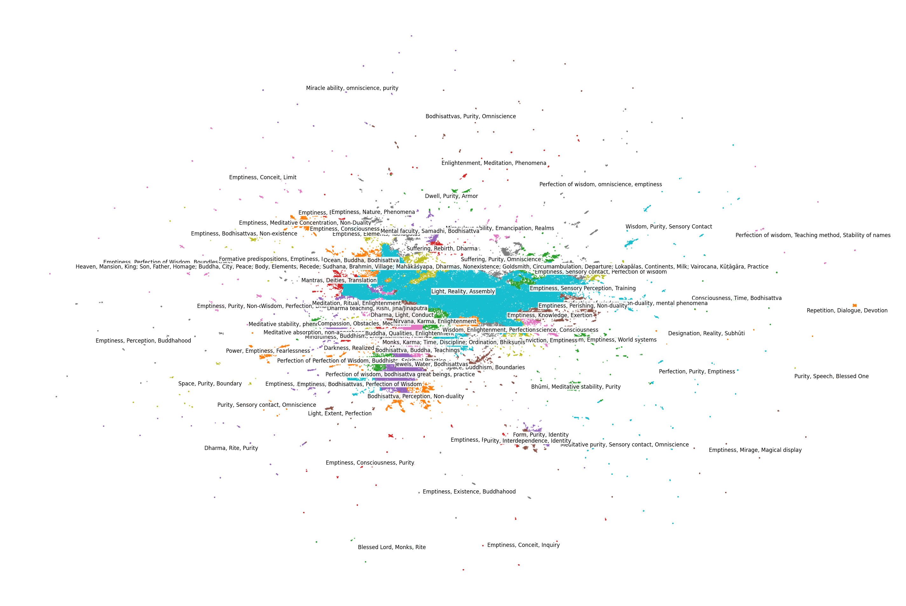
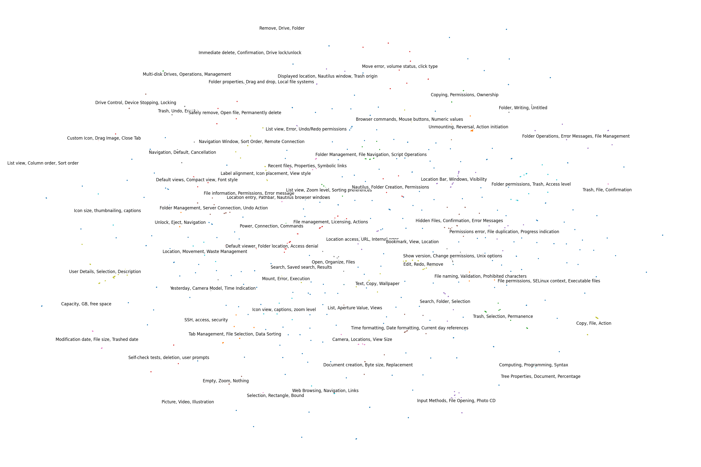
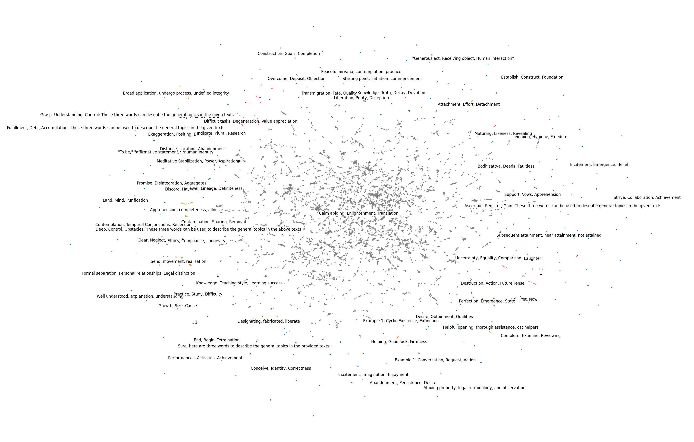

# Aggregating Publicly Available Tibetan-English Parallel Corpora

## Introduction
In this post, I present the dataset **[billingsmoore/Aggregated-bo-en](https://huggingface.co/datasets/billingsmoore/Aggregated-bo-en)**, which aggregates all of the publicly available Tibetan-English parallel corpora that I have been able to find. The final dataset size is **878,004 translation pairs**.

Each subset of this data has been formatted for easy use with Hugging Face compatible workflows, and (with the exception of the Lotsawa House data) has been labelled with a 'topic' using the **[easy_text_clustering](https://pypi.org/project/easy-text-clustering/)** library. Not every label is identically reliable, see the sections below for the distribution of topic labels in each dataset.

Each subset is listed below and is named according to the following schema: "[Name of original source]-bo-en".

This dataset aggregates the following datasets:

- [billingsmoore/84000-bo-en](https://huggingface.co/datasets/billingsmoore/84000-bo-en)
- [billingsmoore/GNOME-bo-en](https://huggingface.co/datasets/billingsmoore/GNOME-bo-en)
- [billingsmoore/Hopkins-bo-en](https://huggingface.co/datasets/billingsmoore/Hopkins-bo-en)
- [billingsmoore/LotsawaHouse-bo-en](https://huggingface.co/datasets/billingsmoore/LotsawaHouse-bo-en)
- [billingsmoore/NLLB-bo-en](https://huggingface.co/datasets/billingsmoore/NLLB-bo-en)
- [billingsmoore/Tatoeba-bo-en](https://huggingface.co/datasets/billingsmoore/Tatoeba-bo-en)
- [billingsmoore/TED2020-bo-en](https://huggingface.co/datasets/billingsmoore/TED2020-bo-en)

More information on the sources, formatting, and processing of those datasets can be found in their respective sections below.

This dataset was concatenated and cleaned (including de-duplication) using [the code found here](https://github.com/billingsmoore/MLotsawa/blob/main/Notebooks/Datasets/Aggregated/AggregateData.ipynb).

### Cleaning Steps

1. De-duplication
2. Remove any emojis
3. Remove rows whose English is just numbers or punctuation
4. Remove rows whose English is just roman numerals
5. Remove rows with empty strings

### Source Distribution

## [84000](https://huggingface.co/datasets/billingsmoore/84000-bo-en)

This dataset is the Tibetan-English sentence pairs from the [84000 dataset](https://github.com/84000/data-tm-alignments).

From the GitHub page for the dataset:

>These works are provided under the protection of a Creative Commons CC BY-NC-ND (Attribution - Non-commercial - No-derivatives) 3.0 copyright. It may be copied or printed for fair use, but only with full attribution, and not for commercial advantage or personal compensation. For full details, see the documentation for [Terms of Use](https://github.com/84000/all-data/blob/master/Terms_of_Use.md).

The dataset was re-formatted for Hugging Face using [the code found here](https://github.com/billingsmoore/MLotsawa/blob/main/Notebooks/Datasets/84000/ConvertToDatasetFormat.ipynb).

The distribution of the data and its topic labels can be seen below.

## [GNOME]()

This dataset is the Tibetan-English sentence pairs from the GNOME dataset.

A parallel corpus of GNOME localization files. Source: [https://l10n.gnome.org](https://l10n.gnome.org/)

This dataset was found on, and downloaded from, [OPUS](https://opus.nlpl.eu/).

Please cite the following article if you use any part of the corpus in your own work: J. Tiedemann, 2012, Parallel Data, Tools and Interfaces in OPUS. In Proceedings of the 8th International Conference on Language Resources and Evaluation (LREC 2012)

The dataset was re-formatted for Hugging Face using [the code found here](https://github.com/billingsmoore/MLotsawa/blob/main/Notebooks/Datasets/GNOME/ConvertToDatasetFormat.ipynb).

The topic labels were generated with [easy_text_clustering](https://pypi.org/project/easy-text-clustering/) using [the code found here](https://github.com/billingsmoore/MLotsawa/blob/main/Notebooks/Datasets/GNOME/TopicLabeling.ipynb) and can be seen below.

Note that smaller datasets have less informative topic labels because clustering becomes less reliable with sparser data.

## [Hopkins](https://huggingface.co/datasets/billingsmoore/Hopkins-bo-en)

This data consists of Tibetan-English text pairs for machine translation. This data was extracted from [Jeffrey Hopkins' Tibetan-Sanskrit-English Dictionary](https://glossaries.dila.edu.tw/data/hopkins.dila.pdf) as prepared as a '.xml' file in **[manyoso/tibetan-corpus](https://github.com/manyoso/tibetan_corpus/tree/master)**.

It was reformatted using [the code found here](https://github.com/billingsmoore/MLotsawa/blob/main/Notebooks/Datasets/Hopkins/ConvertToDatasetFormat.ipynb).

The topic labels were generated with [easy_text_clustering](https://pypi.org/project/easy-text-clustering/) using [the code found here](https://github.com/billingsmoore/MLotsawa/blob/main/Notebooks/Datasets/Hopkins/TopicLabeling.ipynb) and can be seen below.

Note that smaller datasets have less informative topic labels because clustering becomes less reliable with sparser data.

## [Lotsawa House](https://huggingface.co/datasets/billingsmoore/LotsawaHouse-bo-en)

This dataset is a reformatted version of **[billingsmoore/tagged-tibetan-to-english-translation-dataset](https://huggingface.co/datasets/billingsmoore/tagged-tibetan-to-english-translation-dataset)** that better matches the formatting of the other datasets. This is intended to facilitate easy concatenation of these datasets.

The dataset was scraped from Lotsawa House and is released under the same license as the texts from which it is sourced, Creative Commons Attribution Non Commercial 4.0.

The topic labels of this dataset are the tags provided by Lotsawa House for the text from which the sentences were extracted.

## [NLLB](https://huggingface.co/datasets/billingsmoore/NLLB-bo-en)

This dataset is the Tibetan-English sentence pairs from the NLLB dataset (see block quote below).

This dataset was found on, and downloaded from, [OPUS](https://opus.nlpl.eu/).

The dataset was re-formatted for Hugging Face using [the code found here](https://github.com/billingsmoore/MLotsawa/blob/main/Notebooks/Datasets/NLLB/ConvertToDatasetFormat.ipynb).

<blockquote> This dataset was created based on metadata for mined bitext released by Meta AI. It contains bitext for 148 English-centric and 1465 non-English-centric language pairs using the stopes mining library and the LASER3 encoders (Heffernan et al., 2022). The complete dataset is ~450GB.This release is based on the data package released at huggingfaceny AllenAI. More information about instances for each language pair in the original data can be found in the dataset_infos.json file. Data was filtered based on language identification, emoji based filtering, and for some high-resource languages using a language model. For more details on data filtering please refer to Section 5.2 (NLLB Team et al., 2022). Mappings between the original NLLB language IDs and OPUS language IDs can be found in this table. The sentence alignments include LASER3 scores (see XCES align files), language ID scores, source information and URLs from where the data has been extracted (see language XML files).
Please, cite the following papers:

Holger Schwenk, Guillaume Wenzek, Sergey Edunov, Edouard Grave, Armand Joulin and Angela Fan, *CCMatrix: Mining Billions of High-Quality Parallel Sentences on the WEB*

Angela Fan, Shruti Bhosale, Holger Schwenk, Zhiyi Ma, Ahmed El-Kishky, Siddharth Goyal, Mandeep Baines, Onur Celebi, Guillaume Wenzek, Vishrav Chaudhary, Naman Goyal, Tom Birch, Vitaliy Liptchinsky, Sergey Edunov, Edouard Grave, Michael Auli, and Armand Joulin. *Beyond English-Centric Multilingual Machine Translation*

and also acknowledge OPUS for the service provided here by citing Jörg Tiedemann, Parallel Data, Tools and Interfaces in OPUS (bib, pdf)</blockquote>

The topic labels were generated with [easy_text_clustering](https://pypi.org/project/easy-text-clustering/) using [the code found here](https://github.com/billingsmoore/MLotsawa/blob/main/Notebooks/Datasets/NLLB/TopicLabeling.ipynb) and can be seen below.

## [Tatoeba](https://huggingface.co/datasets/billingsmoore/Tatoeba-bo-en)

This dataset is the Tibetan-English sentence pairs from the Tatoeba dataset. It was found on, and downloaded from, [OPUS](http://opus.nlpl.eu/). See the block quote below.

<blockquote>Corpus Name: Tatoeba Package: Tatoeba.bo-en in Moses format Website: http://opus.nlpl.eu/Tatoeba-v2023-04-12.php Release: v2023-04-12 Release date: Wed Apr 12 23:14:42 EEST 2023 License: [CC BY 2.0 FR](https://creativecommons.org/licenses/by/2.0/fr/) Copyright: see https://tatoeba.org/eng/terms_of_use

This package is part of OPUS - the open collection of parallel corpora OPUS Website: [http://opus.nlpl.eu](http://opus.nlpl.eu/)

Please [cite the following article](http://opus.lingfil.uu.se/LREC2012.txt) if you use the OPUS packages and downloads in your own work:
J. Tiedemann, 2012, [*Parallel Data, Tools and Interfaces in OPUS.*](http://www.lrec-conf.org/proceedings/lrec2012/pdf/463_Paper.pdf) In Proceedings of the 8th International Conference on Language Resources and Evaluation (LREC 2012)

This is a collection of translated sentences from Tatoeba License: CC–BY 2.0 FR.</blockquote>

This data was reformatted for Hugging Face from the moses format using [the code found here](https://github.com/billingsmoore/MLotsawa/blob/main/Notebooks/Datasets/Tatoeba/ConvertToDatasetFormat.ipynb). The topic labels were generated with [easy_text_clustering](https://pypi.org/project/easy-text-clustering/) using [the code found here](https://github.com/billingsmoore/MLotsawa/blob/main/Notebooks/Datasets/Tatoeba/TopicLabeling.ipynb) and can be seen below.

Note that smaller datasets have less informative topic labels because clustering becomes less reliable with sparser data, and this dataset is especially small.

## [TED2020]

This dataset is the Tibetan-English sentence pairs from the TED2020 dataset, see the block quote below.

>This dataset is described in [Reimers, Nils and Gurevych, Iryna: Making Monolingual Sentence Embeddings Multilingual using Knowledge Distillation](https://arxiv.org/abs/2004.09813) and contains a crawl of nearly 4000 TED and TED-X transcripts from July 2020. The transcripts have been translated by a global community of volunteers to more than 100 languages. The parallel corpus and the code for creating it is available from https://www.ted.com/participate/translate

Downstream usage must abide by the [TED Talks Usage Policy](https://www.ted.com/about/our-organization/our-policies-terms/ted-talks-usage-policy).

This data was found using, and downloaded from, [OPUS](https://opus.nlpl.eu/). It was reformatted using [the code found here](https://github.com/billingsmoore/MLotsawa/blob/main/Notebooks/Datasets/TED2020/ConvertToDatasetFormat.ipynb).

The topic labels were generated with [easy_text_clustering](https://pypi.org/project/easy-text-clustering/) using [the code found here](https://github.com/billingsmoore/MLotsawa/blob/main/Notebooks/Datasets/TED2020/TopicLabeling.ipynb) and can be seen below.

Note that smaller datasets have less informative topic labels because clustering becomes less reliable with sparser data.

