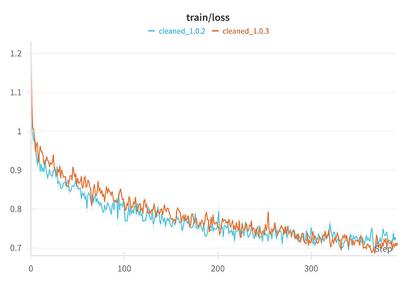
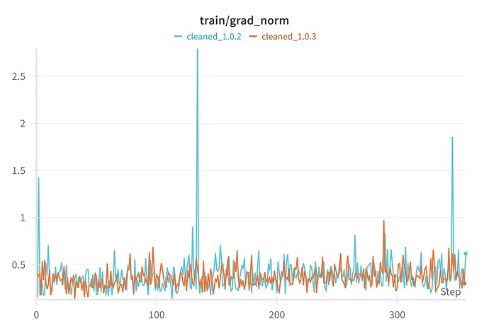

# Validating Data Cleaning for Translation Model Training

*Dec 2024*

**openpecha/cleaned_MT_v1.0.3**  (hereafter "**1.0.3**") was recently created as an iterative improvement on **openpecha/cleaned_MT_v1.0.2** (hereafter "**1.0.2**") with respect to data cleaning. The full process of creating that dataset can be seen in **[Creating openpecha/cleaned_MT_v1.0.3](https://forum.openpecha.org/t/creating-openpecha-cleaned-mt-v1-0-3/142#p-156-creating-openpechacleaned_mt_v103-1)**

In order to validate the improved data quality of this cleaned data, small models were trained on both  **1.0.2**  and **1.0.3** in order to compare performance.

The model trained on  **1.0.3** outperforms the model trained on **1.0.2** with a 22.586% improvement in BLEU score on test data.

## Methods

The model architecture used for this analysis was [Google's T5](https://huggingface.co/docs/transformers/model_doc/t5). The size used was the "small" version of the model with 60 million parameters. One model was trained on each of the two datasets. Both models were trained for a single epoch using code based on the standard [Hugging Face translation tutorial](https://huggingface.co/docs/transformers/tasks/translation). 

The most notable alteration to this standard approach was that the T5 tokenizer does not by default include Tibetan in its vocabulary. To add Tibetan to the tokenizer the following code block was used:

```python
# Generate a list of Tibetan characters
tibetan_chars = [chr(codepoint) for codepoint in range(0x0F00, 0x10000)]

# Add the characters to the tokenizer
tokenizer.add_tokens(tibetan_chars)
```

The model embedding size then needs to be resized like so:

```python
model.resize_token_embeddings(len(tokenizer))
```

The training loop was altered from that suggested by the tutorial mentioned above in that the optimizer used was Adafactor rather than Adam. Adafactor is based on Adam but is less memory-intensive. It is the optimizer that was used in the original pre-training for the T5 architecture, and anecdotally, produces better results on translation tasks.

Both models were evaluated using the [BLEU metric](https://en.wikipedia.org/wiki/BLEU) as implemented by [SacreBLEU](https://pypi.org/project/sacrebleu/). To improve inference time, the Transformers default generation length of 20 tokens was used in producing translation predictions. As such, evaluated BLEU scores should not be taken to reflect actual model performance, only the relative performance of the two models.

The test data used for both models was the 'test' split of **1.0.3**.

## Results

As can be seen below, (Figure 1) training loss for both models is roughly comparable within the single epoch, though the model trained on **1.0.3** performs slightly better by the end of the epoch.



However, in the final evaluation on test data (Figure 2), the model trained on **1.0.3** outperforms the model trained on **1.0.2** with a 22.586% improvement in BLEU score.


## Analyis

We can see that the cleaned data produces meaningfully better performance in our toy example models. We might assume then that it will produce meaningfully better performance in larger models. However, larger models are known to be better in general at handling "noisy" data and performance improvements will likely not be as substantial.

Notably, the less clean dataset, **1.0.2** also produces a distinctive signal in its training gradient norms (Figure 3).



The large spikes in the gradient norms are likely the result of the model encountering especially poor training examples, resulting in a unexpectedly high loss and thus an unusually large update to the model weights. The impacts of these spikes are clear in the model performance.

Here, we also see support for the use of Adafactor as an optimizer. Adafactor is, in general, better at handling these gradient norm spikes than the standard Adam optimizer because of Adafactor's adaptive scaling. This may suggest that one ought to implement a relatively aggressive approach to gradient clipping as well, at least in cases where robust data cleaning is not practical.

## Suggestions for Further Investigation

If a robust relationship between spiky gradient norms and dataset cleanliness can be established, a spiky gradient norm signal may be useful as a heuristic for data cleaning. Spiky gradient norms may generally indicate that further cleaning is necessary, and batches that produce a gradient spike during training could be flagged for further training.