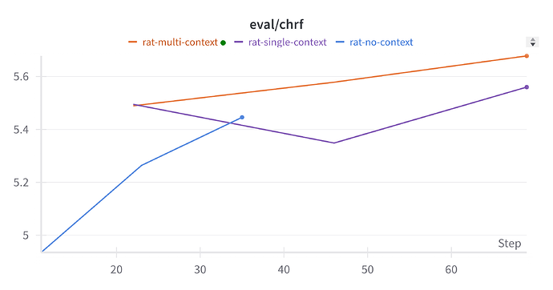

# Validating Retrieval Augmented Translation With T5

*Jan 2025*

## Introduction

Retrieval augmented generation is the use of external context to improve the output of a generative AI model. Retrieval augmented translation (RAT) is the process of applying this approach to machine translation.

T5 is an encoder-decoder model developed by Google for text-to-text machine learning problems, and is regularly used for machine translation.

In this post, I examine the impact of RAT on machine translation quality using T5. My results show that RAT provides modest improvements to  machine translation as evaluated with CHRF.

## Methods

For this post, three separate T5-small models were trained using training data from **openpecha/tagged_cleaned_MT_v1.0.3**. 45000 sentence pairs were used for training and 5000 were used for evaluation.

Each sentence pair from the data was matched with three similar sentences. The English 'Target' sentence was embedded using **paraphrase-MiniLM-L6-v2'** and similarity was measured using cosine similarity of the embeddings.

Each model was trained for three epochs and evaluated using CHRF. CHRF (character level f-score) measures similarity of outputs to a reference translation at the character level. This makes it more resilient to rephrasing or word order changes than word level comparison metrics, like BLEU. 

The first model trained ('No Context') was a baseline model with no RAT context at all. The input of the model was a Tibetan 'Source' sentence and the expected output was an English 'Target' sentence.

The second model trained ('Single Context')  used a single piece of context for RAT. Each input consisted of a Tibetan 'Source' sentence as well as a context translation of its most similar sentence from the dataset. The context translation contained both the 'Source' and 'Target' sentence.

The third model trained ('Multi Context') was identical to the second except that three context translations were provided.

Each model was evaluated with evaluation data that had been prepared in the same manner as the training data, except that evaluation data was given contexts also selected from the training translations in order to mimic the model being provided with context from a previously seen set of translations (i.e. from a reference database).

## Results

As can be seen in the graph below, the models with RAT context outperform the baseline model, and the model with more context performs better than the model with only a single context. Note that while each model was trained for the same number of epochs, the different input lengths necessitated different batch sizes, and therefore a different number of training steps. Thus, the models with context appear right shifted on the graph.

|Final CHRF After 3 Epochs||
|----------------------------|-----------------|
|No Context | 5.45|
|Single Context|5.56|
|Multi Context|5.68|

## Discussion

The results show that providing external context improves translation quality, as measured by CHRF. The Multi Context model outperformed the Single Context model, indicating that additional context further enhances performance.

The gains in CHRF here are relatively modest, and it should be noted that these gains may not necessarily outweigh the added computational cost of longer input sequences that include context or of performing the similarity search to provide that context.

The gains may be more significant with larger models trained on larger datasets, but of course, these added costs will be more significant as well.