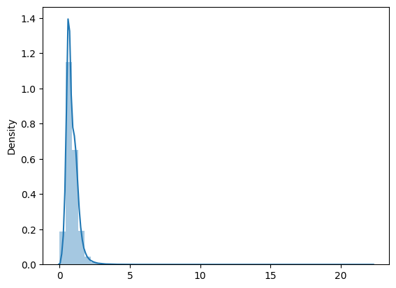

# Sentence Length Proportions As Data Cleaning Heuristic

*Dec 2024*

## Introduction
In conversation, Sebastian Nehrdich suggested that sentence lengths may useful as a heuristic for detecting poor quality sentence pairs in the translation dataset.

As a quick check of this hypothesis, I measured the proportionate lengths of sentence pairs in **openpecha/cleaned_MT_v1.0.3** and looked at machine translations of outliers to determine if those outliers appear to be low quality training pairs.

## Methods

Each pair was measured as the number of unicode characters for the 'source' sentence divided by the number of unicode characters in the 'Target' sentence. In Python, this was done like so:

```python
proportions = [len(elt['Source'])/len(elt['Target']) for elt in dataset]
```

The frequency of these proportions is graphed below.



You can see that the proportions are heavily right-skewed. 99.9% of the dataset has a proportion less than 2. That is, only .01% of pairs have a Tibetan source text that is at least twice the length of the English target text.

Examining some of the examples that fall into this group we can see that there are clear issues with these pairs.

## Example Pairs

### Example 1
Looking at one set of sentence pairs from this set, whose proportion is 2.86, we have:

**'Source':** 'རྫས་སྔགས་ཕྱག་རྒྱ་ཏིང་ངེ་འཛིན་ལེགས་པར་ཚོགས་པ་དམིགས་པའི་རྐྱེན། བུམ་པའི་དབང་སོགས་སྔ་མས་གོ་ཕྱེ་ནས་ཕྱི་མ་རྣམས་རིམ་གྱིས་བསྐུར་ཐོབ་ཏུ་སྨིན་པ་དེ་མ་ཐག་པའི་རྐྱེན་ཏེ་རྒྱུ་གཉིས་རྐྱེན་བཞི་ཚོགས་པས་སྔགས་ཀྱི་འཇུག་སྒོ་དབང་བསྐུར་བ་ཐོབ་ནས། གཉིས་པ་དབང་སྲོག་དམ་ཚིག་བྱ་སྤྱོད་རྣལ་འབྱོར་སོ་སོ་ལས་བཤད་པ་རྣམས་དང་། ཁྱད་པར་བླ་མེད་ཀྱི་བརྟུལ་ཞུགས་དང་སྡོམ་པ་དང་རྩ་བ་ཡན་ལག་གི་དམ་ཚིག་བཟའ་བ་དང་བསྲུང་བ་དྲང་ངེས་ལྡེམ་པོར་དགོངས་ཏེ་གསུངས་པ་རྣམས་རྟོགས་པའི་ཚོད་དང་སྦྱར་ཏེ་སྲོག་བཞིན་བསྲུང་།',

 **'Target':** 'Then is the preparatory empowerment, then making the mandala, then the main empowerment, during which I will explain the Kalachakra empowerment step by step.'

The Monlam-Mitra model translates the Tibetan here as:

>*The conditions for the visualization are the perfect combination of the substances, mantra, mudra, and meditative absorption. The immediate conditions are the ripening of the successive stages of conferral and attainment, such as the vase initiation, which is facilitated by the previous one. By gathering these two causes and four conditions, you obtain the initiation that is the entrance to mantra. The second is the initiation of life force. The pledges are explained in the individual kriya, carya, and yoga tantras. In particular, the conduct and vows of highest yoga tantra and the root and branch pledges of eating and guarding are taught with provisional, definitive, and implicit intentions. Guard them as you would your life force, in accordance with your level of realization.*

While the Monlam-Melong model translates the Tibetan as:

>*The convergence of proper substances, mantras, mudras, and samadhi is the objective condition. The vase empowerment and subsequent empowerments, preceded by the earlier ones, gradually mature through bestowal and receipt. This is the immediate condition. Through the convergence of these two causes and four conditions, one receives the empowerment as the entrance to mantra. Second, the life force of empowerment is the commitments explained in the individual practices of mantra, ritual actions, and yoga. Particularly, the yogic discipline, vows, root, and branch commitments of the highest yoga tantra, including the to-be-eaten and to-be-protected, as well as the teachings given with implied and indirect intentions, should be guarded as one's life force in accordance with one's understanding.*

Both are much *longer*, if not also more accurate renderings than the provided 'Target' text in the dataset.

### Example 2

Another pair from the dataset, whose proportion is 2.25, is:

**'Source':** 'ཁྱེད་ཀྱི་གོན་པ་དེ་འདྲ་རློན་པ་བྱེད་དོན་ཅི་ཡིན།'

 **'Target':** 'Why are you so wet?”

The Monlam-Mitra model gives us:

>*Why are your clothes so wet?*

And Monlam-Melong:

>*Why did you get your clothes so wet?*

We can see the models largely agree, and that they closely approximate the 'Target' sentence.

### Example 3

For a more extreme example, we can look at a pair whose proportion is 12.49 (belonging to the largest .00000279%).

**'Source':** 'ཇོ་རིག་ཐུའི་བུ་རྒྱལ་མཚན་བཀྲ་ཤིས་ལ་ཁལ་བཞི་བཅུ་རྣམས་འབྲས་སྤུངས་སུ་བསླབ་གཉེར་ལ་སྡོད་རིང་སྤྲོད་འཛིན། དཀའ་བཅུ་བློ་བཟང་ལྷུན་གྲུབ་ཁམས་ནམ་འཚོའི་བར་ལྷོ་རོང་ནས་ཁལ་བརྒྱད་རེ། སེ་ར་སྨད་གྲ་ཚང་པར་ཆུ་སྨད་པའི་གཡོག་དངོས་གྲུབ་ཚེ་རིང་གིས་བསྒྲུབ་པའི་ཞིང་གཞུང་སྐྱོང་སྟབས་སྔར་འཇགས་བབ་འབྲེལ་མ་བྱུང་ཡང་གྲ་ཚང་གཞན་དང་མ་འདྲ་གཤིས་ཇི་སྲིད་བར་འཇགས་གནས། སྣེའུ་སྡོང་བོགས་ཤས་ཀྱི་ཡོང་སྒོ་ལེན་དེབ་སེལ་ལེན་རྣམས་ནས་ནག་འཇམ་རིམ་ལུས་སུ་སོང་བ་སྡེ་པ་བློ་བཟང་སྦྱིན་པས་ཞིབ་གཅོད་མཛད་པ་ཐོ་གསར་ཐོན་གྲས་རྣམ་པར་རྒྱལ་བའི་ཕན་བདེ་ལེགས་བཤད་གླིང་མཆོད་ཡུལ་གཞན་དང་མི་འདྲ་ཞིང་ངེད་རང་གི་རིང་འཚོར་དམིགས་མཁའ་རུའི་ཁལ་ཉིས་བརྒྱ་གྱ་གསུམ་སྦྱོར་འཇགས། གཞིས་རྩེ་གསོ་རིག་སློབ་གྲར་སྨན་བླ་རྒྱུན་གཏོང་སྟེང་ཆོས་ཐོག་ཟླ་བ་བརྒྱད་པའི་ཚེས་བཅོ་ལྔ་དང་གནམ་གང་ལ་ངེད་ཀྱི་རིང་འཚོར་སྨན་བླ་ཉིན་གང་མ་བཅས་གཏོང་ཐེབས་སྔ་ཕྱི་བསྡོམས་བདེ་སྐྱིད་པ་ཅན་ཐེམ་ལྔ།'

 **'Target':** 'On the 14th, the Dalai Lama performs the ritual of longevity.'

Monlam-Mitra suggests:

>*Gyaltshen Trashi, the son of Jorigthu, was given khal of barley for his studies at Drepung. Kachu Lobzang Lhundrub and Khamnamtsho each received khal of barley from Lhorong. The monks of Sera Me College were given khal of barley for their studies. The monks of Sera Me College were given khal of barley for their studies at the College of the College of the College of the College of the College of the College of the College of the College of the College of the College of the College of the College of the College of the College of the College of the College of the College of the College of the College of the College of the College of the College of the College of the College of the College of the College of the College of the College of the College of the College of the College of the College of the College of the College of the College of the College of the College of the College of the College of the College of the College of the College of the College of the College of the College of the College of the College of the College of the College of the College of the College of the College of the College of the College of the College of the College of*

Monlam-Melong:

>*'Jotuktu's son Gyaltsen Tashi will receive forty loads while staying at Drepung for study. Daklo Zang Lhundrub will receive eight loads annually from Lhorong for as long as he lives. Chumedpa's servant Ngodrup Tsering established fields for Sera Med Gatsang, which were later confiscated by the government. Although this affected the previous arrangements, since this Gatsang is different from others, it will remain intact for as long as possible. The annual income from Neudong lease was collected by Deb Selen. Depa Lobsang Jinpa investigated the gradual decline of this income and made new arrangements. Nampar Gyalwai Pende Lekshe Ling is a unique place of worship. For my long life, 293 loads of Kharu were permanently allocated. In Shigatse Medical School, Menla (Medicine Buddha) rituals were regularly performed. On the 15th and 30th of the eighth month, full-day Menla rituals were performed for my long life. The total amount collected for these rituals, including Dekepa, was five tem. '*

Melong's translation is clearly preferable though they agree in the broad strokes and both plainly diverge from the suggested 'Target' translation.

## Discussion

I do not take this analysis to be exhaustive but do think that it is suggestive of a path forward. There are clearly problematic sentence pairs among the outliers here. Thus, proportionate sentence length is likely to be a useful heuristic. It may not be as simple as just removing the top 1% of the data, as there are also clearly unproblematic cases in that group. However, in a dataset as large as **openpecha/cleaned_MT_v1.0.3**, the loss of 1% (or perhaps less depending on how tenacious one wants to be about cleaning) may not be a significant sacrifice in exchange for a cleaner dataset.