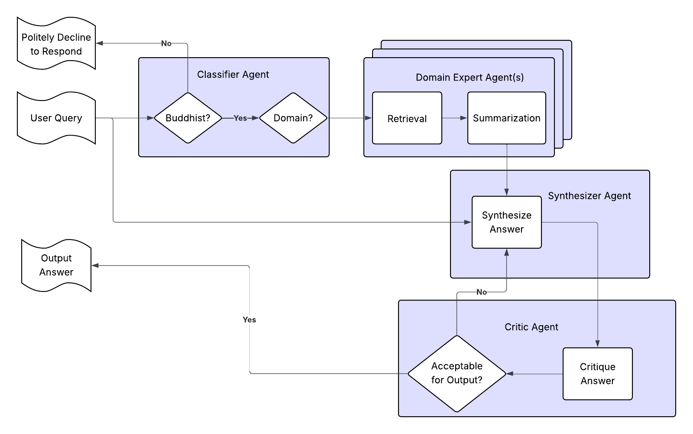

# Gyalpo: Toward Effective Buddhist Question Answering With Large Language Models

## Introduction

In the namtar of Thangtong Gyalpo, the mahasiddha creates a talking statue of himself to teach in his place after he has left. Current large language model performance provides an opportunity to reproduce this miracle for modern students of the dharma.

This post outlines an AI system designed to provide accurate, context-aware responses to questions about Buddhism. The architecture employs a multi-agent pipeline that begins with a classifier agent verifying relevance and routing queries to specialized domain experts, each responsible for distinct aspects of Buddhist knowledge (e.g. philosophy, ethics, scripture). These experts retrieve and preprocess relevant materials before a synthesizer agent crafts a coherent response, which is then refined by a critic agent to ensure doctrinal consistency, cultural sensitivity, and clarity.

The pipeline suggested in this post is based on current standard approaches in chatbot design and inspired by the successful application of large language models for question answering in other senstive domains, in particular, [Magisterium](https://www.magisterium.com/) for Catholicism.

This post is intended more as a conversation starter than as a blueprint or design document. It is my hope that the pipeline below can be further fleshed out, improved, and ultimately implemented by this community.

## Skeletal Overview of Query Processing Pipeline

1. **Classifier Agent (Gateway)**
   - *Summary*: Acts as the initial filter and router for all incoming queries
   - *Functions*:
     1. **Relevance Verification**: 
        - Determines whether the query falls within the domain of Buddhism
        - Filters out irrelevant or inappropriate queries
     2. **Domain Classification**:
        - Identifies the specific subdomain(s) of Buddhism the query addresses (e.g., meditation, ethics, philosophy, scriptures)
        - May use multi-label classification for queries spanning multiple domains
     3. **Query Routing**:
        - Directs the query to the most appropriate domain expert(s)
        - May request clarification for ambiguous queries

2. **Domain Expert Agents**
   - *Summary*: Specialized retrieval-augmented generation (RAG) agents
   - *Functions*:
     1. **Retrieval** 
        - Search their dedicated knowledge subdomains for relevant context
     2. **Routing**
        - Optionally decompose complex queries and route components to subdomain experts
     3. **Summarization**
        - May perform initial processing or summarization of retrieved materials
   - *Notes on Hierarchy*:
     - Some experts could serve as supervisors which route queries to sub-domain experts
     - Could supports recursive delegation (experts can call sub-experts to arbitrary depth)
     - Parent experts may synthesize outputs from child experts
   - *Benefits of Domain Segmentation*:
        - Smaller search spaces enable faster retrieval
        - Prevents cross-contamination between distinct contexts e.g.:
          - Lay vs. monastic ethical guidance
          - Different philosophical interpretations (e.g., differing views on "emptiness")

3. **Synthesizer Agent**
   - *Summary*: Takes in original query and curated context from domain experts
   - *Functions*:
     - Integrates multiple sources when applicable
     - Resolves minor inconsistencies in retrieved materials
     - Structures response for coherence and readability
   - *Output*: Draft response for critique

4. **Critic Agent (Quality Assurance)**
   - *Summary*: Constitutional AI-inspired critic reflects on synthesized output to ensure quality and alignment
   - *Evaluation Criteria*:
     1. **Doctrinal Soundness**:
        - Consistency with Buddhist principles
        - Appropriate tradition-specific alignment
     2. **Communicative Quality**:
        - Cultural sensitivity
        - Offensiveness prevention
        - Clarity and pedagogical effectiveness
   - *Additional Notes*:
     - May request revisions from synthesizer
     - Can escalate to human review for borderline cases

5. **Finalization Stage**
   - *Options*:
     - Simple: Critic-approved version from synthesizer
     - Complex: Additional polishing by dedicated presentation agent
   - *Output Features*:
     - Proper sourcing attribution when applicable
     - Appropriate disclaimer for controversial topics
