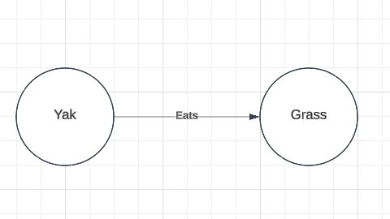
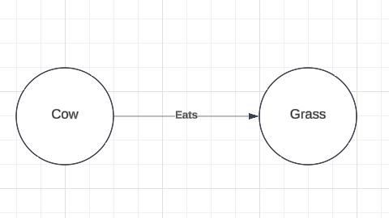
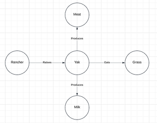
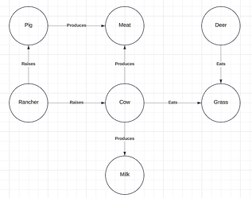
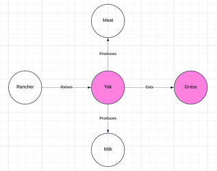
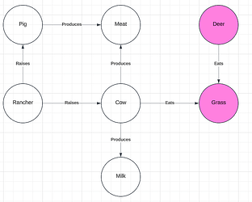
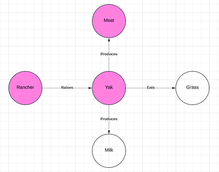
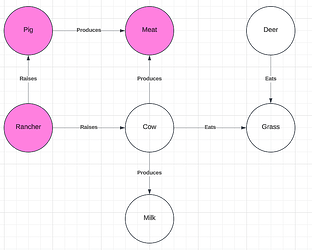
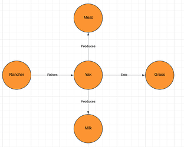
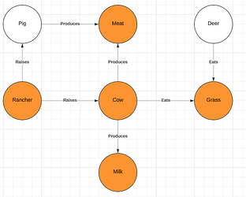

# Knowledge Graphs for Accessible Machine Generated Translations and Commentaries

*Jan 2025*

## Introduction

Recently, Ngawang Trinley and I discussed the challenge of making Tibetan texts accessible to Western readers who lack the cultural context that those texts assume. He gave the example of yaks, a livestock animal widely familiar to Tibetans, but much less common in the west. 

Consider the following passage from *[Advice for Chokling Tulku of Neten Monastery](https://www.lotsawahouse.org/tibetan-masters/jamyang-khyentse-chokyi-lodro/advice-for-negon-choktrul)* by Jamyang Khyentse Chökyi Lodrö:

>Now, while you’re in the prime of youth,
Apply yourself physically, vocally and mentally
To all aspects of study, approach and accomplishment,
Like a hungry yak voraciously munching grass.

To the reader unfamiliar with yaks it may be unclear whether "munching grass" is typical behavior for a yak. The author may be describing a predatory animal being made to eat grass, perhaps through discipline or training, giving a very, very different meaning to the passage as a whole.

One, admittedly simplistic solution to this problem is to simply replace the word "yak" with "cow", a roughly similar livestock animal with which western readers are more familiar, or (probably better) to provide a footnote that explains this similarity. Of course, this is just one example and a general solution for resolving this sort of problem is worthy of consideration.

In this post, I explore the use of knowledge graphs to address this problem, keeping with the example of yaks for simplicity. I suggest, as a general solution, that a given term from a source corpus (the source term) can be provided with a comparable term from a target (the target term) by finding the largest isomorphic sub-graphs within knowledge graphs of the source and target corpi.

Below, I present an intuitive argument for this approach, then provide problem statement in the terminology of formal graph theory. With this formalism, I sketch a potential algorithm and some possible areas of improvement for that naive approach.

My goal in this post is not to present a solved problem, but to open an avenue of investigation that I believe may be fruitful for the production of accessible translation and commentaries. 

I believe that this approach, or one very much like it, could also be used to find translations for terms within a source corpus that do not appear in translation training data and that this may provide a mechanism for improving translation quality as a result.

## Knowledge Graphs, An Intuitive Exploration

### A Simple Case

A knowledge graph is a directed, labeled graph whose vertices are entities and whose edges are relations between those entities. For the purposes of this analysis, I will restrict vertices to nouns and edges will represent verbs. Thus, for two vertices, v1 and v2, and an edge, e1, the triple (v1,  e1, v2) would be equivalent to the subject-verb-object structure that is typical in English.

Below, I present a knowledge graph that contains only the information that yaks eat grass (Figure 1).

 *Figure 1*

We can see that there is a very similar graph that conveys that cows eat grass (Figure 2).

*Figure 2*

Two graphs are said to be **isomorphic** when there is a bijection between them that preserves the graphs' vertices and their relations. Intuitively, for a knowledge graph, we can say that two knowledge graphs are isomorphic when they contain the same entities (nouns) connected by the same relations (verbs). 

The two knowledge graphs above fail to meet this definition because, while they both contain the entity "grass" and the relations "eats", Figure 1 contains "yak" where Figure 2 contains "cow". However, they are isomorphic except for the fact that the source term (yak) has been replaced with the target term (cow). I will refer to this approximate isomorphism as **relevant isomorphism**.

In this simplified case, I hope it is clear that "cow" is a viable target term for the source term "yak", at least with respect to the passage quoted above from Jamyang Khyentse Chökyi Lodrö. This case does not make it obvious, however, that "cow" is a viable target term in general. Below, I will explore how we could demonstrate the general viability of a target term.

### A More General Case

Consider the two more general knowledge graphs below (Figure 3). The graph on the left provides a larger context for the term "yak" and the graph on the right provides a larger context for the term "cow". I will refer to the graph on the left as the **source graph** and the graph on the right as the **target graph** as they will stand in for knowledge graphs created from the source and target corpi.

 
*Figure 3: Source and Target Graphs*

We can see that the source and target graphs contain the graphs in Figure 1 and Figure 2 (respectively) as sub-graphs. That is, the graph from Figure 1 is entirely contained within the source graph, and the graph from Figure 2 is entirely contained in the target graph. Thus, we have preserved the **relevant isomorphism** of the sub-graphs. However, these larger graphs also contain competitors for the target term. Below, we can see that in the larger context, we might also think that "deer" is a viable target term for the source term "yak" (Figure 4).

 
*Figure 4*

We can see that the sub-graphs that are highlighted in pink are also **relevantly isomorphic**.  But, the use of "deer" as the target term fails to capture other use-cases for the term "yak". 

For example in *[A Song to Introduce the Unmistaken View of the Great Perfection](https://www.lotsawahouse.org/tibetan-masters/khenpo-gangshar/song-to-introduce-unmistaken-view)* by Khenpo Gangshar we find the following passage:

> *Ema*, child of great fortune!
Sit without moving your body,
Like a peg [*footnote*] driven into hard earth!

Whose [footnote](https://www.lotsawahouse.org/tibetan-masters/khenpo-gangshar/song-to-introduce-unmistaken-view#fn:3) explains:

> The Tibetan word refers to a peg that is used to tether a baby yak to prevent it from approaching its mother, so that milk can be harvested from the mother.

Here we have a mention of a yak which is independent of its diet. Instead, a relevant factor here is that the yak produces milk, and that it is readily managed by a human agriculturalist (referred to as a "rancher" in our graphs).

In this relationship to the "rancher" we find a different competing target term, "pig". We can see below that pigs are also raised by "rancher"s and that they produce meat, as do yaks. This provides a distinct set of sub-graphs (Figure 5) that are **relevantly isomorphic** and are larger than the sub-graphs highlighted in Figure 4.

 
*Figure 5*

The larger size of these sub-graphs also provides for a larger number of possible contexts of usage for which the target term "pig" might be viable. While it fails to accommodate the use-case of "yak" as an entity which produces milk, it is both an entity which is raised by a "rancher" and which produces meat. (It is true that, in reality, deer also produce meat, but that relation is not found in our target graph).

Below (Figure 6), we can see that our source and target graphs contain a larger pair of sub-graphs which show that "cow" provides the best target term within the context of these graphs. These larger sub-graphs, again, provide a larger set of possible usage contexts for which "cow" would be a helpful comparison or reference point of readers unfamiliar with "yak"s.

 
*Figure 6*

## Knowledge Graphs, A Formal Approach

### Definitions

Given a corpus of texts to be translated or explicated, referred to as the **source corpus** (*CS*), and  a corpus of texts from which references can be drawn to aid in translation or explication, referred to as the **target corpus** (*CT*).  

We can construct two knowledge graphs  *S = (VS, ES)*, the knowledge graph of the source corpus, and  *T = (VT, ET)*, the knowledge graph of the target corpus.  

Each graph is defined by a set of vertices (*v ∈ V*) representing entities (nouns), and  a set of edges (*e ∈ E*) representing relationships or actions (verbs), connecting the vertices.  

A **sub-graph** *G' = (V', E')* of a graph *G = (V, E)* is a graph such that *V' ⊆ V*,  *E' ⊆ E*, and  the relationships between vertices in *G'* are preserved as in *G*.  

Let *vS ∈ VS* denote a particular **source term** in the graph *S* for which we wish to find a corresponding **target term** *vT ∈ VT* in the graph *T*.

Two graphs *G1 = (V1, E1)* and *G2 = (V2, E2)* are **isomorphic** if there exists a bijection *f: V1 → V2* such that for every edge *(vi, vj) ∈ E1*, there exists an edge *(f(vi), f(vj)) ∈ E2*, and the labels on vertices and edges are preserved under *f*.

Two sub-graphs *S' ⊆ S* and *T' ⊆ T* are **relevantly isomorphic** if they are isomorphic, except that the **source term** *vS* in *S'* is replaced by a candidate **target term** *vT* in *T'*.

###  Problem Statement
The **best target term** *vT ∈ VT* is defined as the candidate target term such that among all sub-graphs *T' ⊆ T* that are relevantly isomorphic to a sub-graph *S' ⊆ S*, *T'* is the largest such sub-graph in terms of the number of vertices (*|VT'|*) and edges (*|ET'|*).

Formally, we want to find *vT* such that:  

vT = **argmax**vT ∈ VT(**max**T' ⊆ T, S'⊆ S  ({|VT'| + |ET'| }))

subject to the constraint that *T'* and *S'* are relevantly isomorphic, with *vT* replacing *vS* in *T'*.

### A Sketch of An  Algorithm

A naive approach to this problem looks something like:

1. For each potential target term vT enumerate all sub-graphs of T that include vT​.
2. For each sub-graph T′ containing vT, check against sub-graphs S′ of S containing vS​.
3. Ensure T′ and S ′are relevantly isomorphic.
4. Calculate the score for each match (|VT'| + |ET'|) and track the highest score for each  vT​​.
5. Return the vT​ that maximizes the score.

This comes with significant complexity concerns. Because we are working with knowledge graphs, we can leverage some of the benefits of labeled edges and vertices to restrict our search space to only those sub-graphs of S which contain the edges connected to our vS. For example, we know that the term "yak" is connected by an edge labelled "eats" to the vertex "grass" and by the edge "produces" to the vertex "milk", and so on. We can filter the sub-graphs of T to only bother with those that also contain the relevant relationships. We can then also restrict potential vT to those that have at least one matching edge-vertex pair.

Thus, we can improve upon the naive approach like so:

1. Enumerate all sub-graphs S′ ⊆ S that contain vS.
2. Enumerate all sub-graphs T' ⊆ T that contain at least one edge-vertex combination in common with neighbors of vS.
3. Ensure T' and S' are relevantly isomorphic for each set of candidates
4. Calculate the score for each match (|VT'| + |ET'|) and track the highest score for each  vT​​.
5. Return the vT​ that maximizes the score.

There are further refinements that can be made here. For example, T' for which the score is known to be less than the current best scoring match need not be evaluated and I'm certain that other optimizations have been overlooked here. 

## Conclusion

The use of knowledge graphs presents a promising method for addressing challenges in cross-cultural translation and commentary, particularly when translating culturally specific terms in a source corpus. 

I believe that the concept of **relevant isomorphism** between sub-graphs, may help to identify target terms that best preserve the contextual and relational meaning of source terms. 

The sketch of an algorithm outlined here offers a foundation but there are clearly significant opportunities for optimization, particularly in narrowing the search space and improving computational efficiency. 

Still, this approach has the potential to enhance translation accuracy or, at least, provide more culturally accessible results.