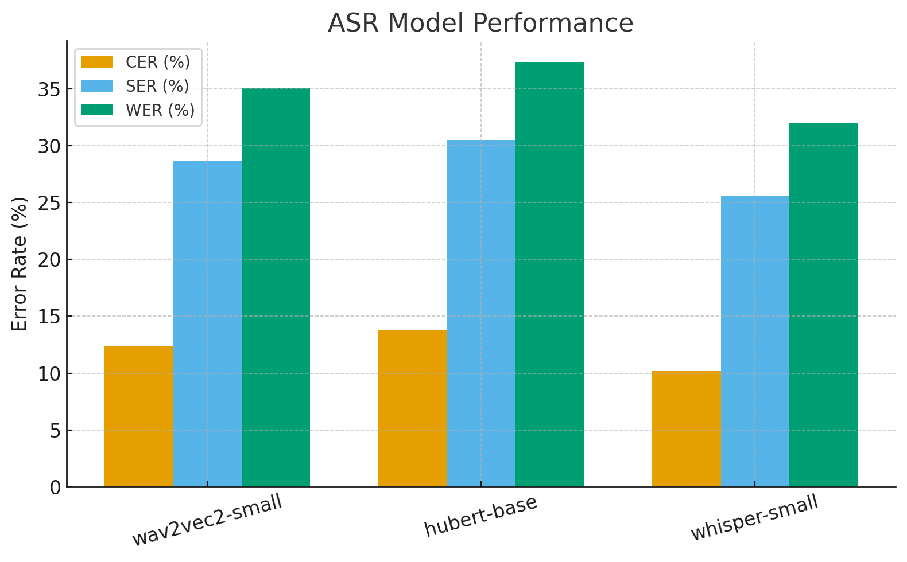

# Technical Report Guide

This document provides a guide to writing technical reports about model training. This document provides a suggested format and examples (given in italics) for each section. Note that *the examples are only examples* and are not necessarily accurate. Following this guide will help to ensure that technical reports are uniform and easy to read and understand quickly.

**General Guidelines:**
* Always be as brief as possible. Technical reports should be short and easy to read.
* Always be as simple as possible. Technical reports should make sense even non-technical readers.
* Always include visualizations. Graphs are faster and easier to read than tables of numbers.
* Whenever possible include hyperlinks to additional information.
* Investigate one question at a time (Which architecture is best?), and clearly separate results and discussions for separate questions.

A good technical report should include the following:

- [Technical Report Guide](#technical-report-guide)
  - [Summary](#summary)
    - [Example](#example)
  - [Description of Methods](#description-of-methods)
    - [Data](#data)
      - [Example](#example-1)
    - [Metrics](#metrics)
      - [Example](#example-2)
    - [Models](#models)
      - [Example](#example-3)
    - [Experiment Setup](#experiment-setup)
      - [Example](#example-4)
  - [Results](#results)
    - [Example](#example-5)
  - [Discussion](#discussion)
    - [Example](#example-6)

## Summary

This section should provide a summary of the report that is no longer than a paragraph. The summary should include only the most important details and provide the key results and decision recommendations. Whenever possible, the cost of training runs should be included in this section. The summary should include the following:

1. Description
2. Costs
3. Results
4. Recommendations

### Example

***Description:** This report describes model training for initial architecture selection for an automatic speech recognition model to transcribe audio of Garchen Rinpoche for the Garchen Archive project.*

***Cost:** $15.89* 

***Results:** The best architecture in these tests was Whisper Small.*

***Recommendations:** We recommend proceeding with Whisper Small for full finetuning.*

## Description of Methods

The description of methods should include the following information:

1. Data
2. Metrics
3. Models
4. Experiment Set Up

### Data

This section should describe the dataset used including: 
1. The source and name of the dataset (with a link if possible)
2. The size of the dataset
3. How the data is split up (i.e. train, dev, test)

#### Example

*The data used for these experiments was [openpecha/garchen_rinpoche_data](https://huggingface.co/datasets/openpecha/garchen_rinpoche_data).*

    Total audio duration: 5.6 hours
    Number of audio segments: 3071
    Content type: Teaching material of Garchen Rinpoche
    Speaker age group: 70-90 years

*The data is split into training and test sets. The test set consists of 10% of the total data.*

### Metrics

This section should describe the metrics used and provide a brief definition for each. Whenever possible, a link to more information about metrics is good to include. Ideally, these links should be to a Wikipedia article or scholarly publication to ensure quality.

#### Example

*The metrics used for these experiments were Character Error Rate, Syllable Error Rate, and Word Error Rate.*

*Character Error Rate (CER): The percentage of characters that were incorrectly recognized in the transcription compared to the reference text.*

*Syllable Error Rate (SER): The percentage of syllables that were incorrectly recognized in the transcription compared to the reference text.*

*[Word Error Rate](https://en.wikipedia.org/wiki/Word_error_rate) (WER): The percentage of words that were incorrectly recognized in the transcription compared to the reference text.*

### Models

This section should describe the models used including:

1. Name of the model (i.e. wav2vec 2.0)
2. Basic description of architecture (i.e. encoder-decoder, autoregressive decoder)
3. The size of the model (i.e. 20 million parameters)

Links to read more about the models on Hugging Face are encouraged.

#### Example

*The models used for these experiments are: wav2vec2-small, hubert-base, and whisper-small.*

*  [**wav2vec2-small**](https://huggingface.co/docs/transformers/model_doc/wav2vec2) – *A self-supervised speech representation model based on a Transformer encoder architecture. *Size:* \~22 million parameters.*

* [**hubert-base**](https://huggingface.co/facebook/hubert-base-ls960) – *A self-supervised speech model that combines a convolutional feature encoder with a Transformer. *Size:* \~95 million parameters.*

* [**whisper-small**](https://huggingface.co/openai/whisper-small) – *An encoder–decoder Transformer pretrained on multilingual and multitask speech data. *Size:* \~244 million parameters.*

### Experiment Setup

This section should describe how training was conducted including:

1. Hardware used for training (i.e. A100 GPU on Google Cloud)
2. Training hyperparameters including:
   1. Optimizer
   2. Learning Rate
   3. Batch Size
   4. Number of training steps or epochs

#### Example

**Experiment Setup**

*Training was performed on a single **NVIDIA A100 GPU** hosted on Google Cloud. We used the AdamW optimizer with a learning rate of **3e-5**, a batch size of **32**, and trained for **3 epochs**. Early stopping was applied based on validation loss to prevent overfitting.*

## Results

This section should describe the results of model training and should include all metrics described in the [Metrics](#metrics) section. These results should be provided in a table like the one below, and the results should also be summarized (without analysis) in complete sentences. Be sure to only provide results that directly contribute to answering the question that is being investigated.

| Model       | Metric A | Metric B | Metric C |
| ----------- | -------- | ---------| -------- |
| **Model A** | Result   | Result   | Result   |
| **Model B** | Result   | Result   | Result   |

Graphs should also be included in this section. The graphs below are only examples and different types of visualization may be more appropriate. Recommended visualizations include:
* bar charts that compare model performance
* line graphs from Weights and Biases showing evaluation results during training

### Example

| *Model*              | *CER* (%) | *SER* (%) | *WER* (%) |
| ------------------ | ------- | ------- | ------- |
| ***wav2vec2-small*** | *12.4*    | *28.7*   | *35.1*    |
| ***hubert-base***    | *13.8*    | *30.5*    | *37.4*    |
| ***whisper-small***  | *10.2*    | *25.6*    | *32.0*    |

*Overall, whisper-small achieved the lowest error rates across all metrics, while hubert-base showed the highest. wav2vec2-small performed between the two on all measures.*

## Discussion

This section should briefly discuss the results described in the [Results](#results) section and explain how those results lead to a conclusion about the question being investigated. This section should provide proposed explanations for why the results are how they are. If there was anything notable or out-of-the-ordinary in the results of during training (e.g. model performance improved but loss increased) that should be mentioned here.

This section should also provide recommendations for next steps based on those results. Recommendations might include: additional experiments, focusing on training a particular model or with a particular dataset, etc.

### Example

*Whisper-small gave the best results, likely because it is larger and trained on more diverse speech data. Wav2vec2-small performed in the middle, and hubert-base had the highest error rates.*

*Next steps could include fine-tuning whisper-small on more Tibetan data, trying stronger data augmentation, or testing larger wav2vec2 models to see if they can close the gap.*

