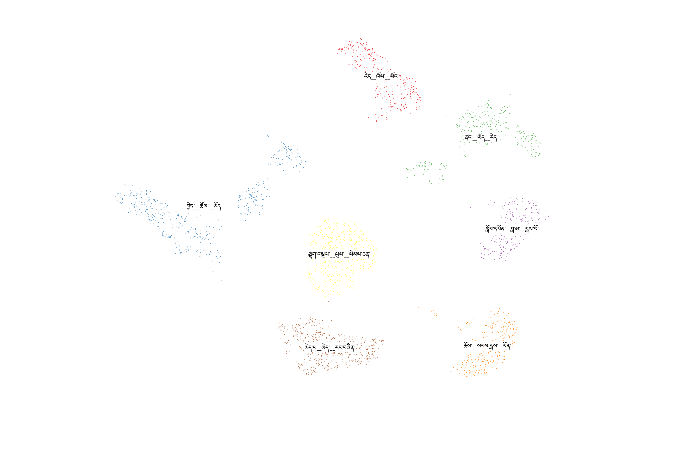

# A Pipeline for Tibetan Language Text Clustering 

## Introduction

Text clustering is a natural language processing task in which pieces of text (sometimes referred to as "documents") are grouped, or "clustered", based on similarity in order to better understand the contents of the set of texts and the relationships between subsets in the texts. To keep this post as accessible as possible, I will try to avoid overly technical explanations and will provide links to relevant information throughout for readers who would like to know more about particular details.

How the notion of "similarity" is defined and formalized varies, and different approaches may be preferable for different use-cases. One standard approach is to "embed" the texts as a vector, a sequence of numbers or arrays, which represents the information contained in the text. These vectors can then be treated as coordinates in a "space", and similarity can be measured by measuring the distance between those coordinates in that imagined space. In this piece I present a pipeline for clustering texts that are written in the Tibetan language that is based on this approach. My implementation is very similar to that of [Bertopic](https://maartengr.github.io/BERTopic/index.html), but it's customized to accomodate the unique features of Tibetan text.

Clustering Tibetan texts presents a unique challenge because of its unique writing system. This writing system makes traditional natural language processing methods, which were often designed to process English or some other Western language (typically one written in the Latin alphabet). Thus, any process of tokenizing or embedding the texts must be customized.

This problem then re-presents itself after the texts have been clustered, because these clusters must be summarized and labeled. The two standard approaches for cluster summarization are to either have a language model provide a summary of the texts in the cluster, or to find the most common words within the cluster and provide them as a list, which acts as a rough guide to the contents of the cluster. 

Creating summarizations using a language model would require training or finetuning a model using a dataset of high quality Tibetan langauge summaries, but I am not aware of an existing dataset of this type. Instead, I have implemented the second approach mentioned above, which is to find the most common words in the cluster and use them as a guide to the clusters' contents. Again, the unique orthography of Tibetan presents a challenge. Written Tibetan makes the beginning and ending of individual words ambiguous, and therefore programmatically breaking Tibetan into words (a process known as "word segmentation") is difficult.

I will address each of these two problems and the solutions used by this pipeline in the relevant sections below. But first, I present a rough overview of the steps of the pipeline.

## Text Clustering - Intuitive Overview

This pipeline consists of four primary steps. First, texts are embedded by an embedding model. Second, those embeddings, which have a very large number of dimensions, are projected down into a lower dimensional representation using the [UMAP algorithm](https://umap-learn.readthedocs.io/en/latest/). Third, those projected embeddings are clustered using the [HDBScan algorithm](https://hdbscan.readthedocs.io/en/latest/how_hdbscan_works.html). Fourth, clusters are summarized by finding their most frequent words, relative to the frequency of words in the group of texts as a whole. 

It is the embedding and cluster summarization steps of this pipeline that must be adapted for the Tibetan language. These customizations are explained in detail later on.

### Embeddings

Texts are first embedded using a Sentence Transformer model. A common example of a Sentence Transformer model that might be used for this is [BERT](https://en.wikipedia.org/wiki/BERT_(language_model)), although this pipeline uses a smaller model (see the relevant section below). The embeddings are mappings to a 384-dimensional dense vector space. Intuitively, we can understand these as coordinates, with the same properties as coordinates in two or three dimensions. While it is not possible to mentally visualize a 384 dimensional space, the same intuitions (and many of the same mathematical rules) apply in the way that one would expect. Importantly. the distance between these embeddings can be calculated in the same way as finding the distance between lower-dimensional coordinates. However, in high dimensional space, distance becomes difficult to calculate in a computationally efficient way. Thus, it is preferable to project the embeddings into a lower dimensional representation.

### Projection

High dimensional embeddings are projected to a lower dimensional representation (in this case just two dimensions) using the UMAP algorithm. UMAP stands for Uniform Manifold Approximation and Projection which refers to the fact that the algorithm assumes that the initial embeddings are uniformly distributed on a Riemannian manifold. 

In order to be representable as distributed on a Riemannian manifold, a set of data just needs to obey the standard mathematical rules of space as we generally understand it. Here, we meet that definition in that the high-dimensional embeddings have a well-defined "distance" except that it is measured in 384, rather than 3, dimensions.

UMAP then "projects" these embeddings down to the specified number of dimensions. This projection is frequently compared to a shadow. A three dimensional object "projects" a two-dimensional shadow onto a surface. Similarly, UMAP creates a two-dimensional shadow of our 384-dimensional embeddings. 

Once data is in a two-dimensional representation, calculating the distance between the data points becomes very straightforward.

### Clustering

The two-dimensional projected embeddings are then clustered using the HDBScan algorithm. Intuitively, this algorithm is searching for patches of data points that are "denser" compared to the other sets of points in their vicinity. 

For example, five points that are right beside one another but far away from any other data points could be assigned to one cluster. Similar 'clumps' of points are then found and separated out as their own clusters. More formally, this is done by creating a hierarchy out of the minimum spanning tree of points in the space in order to find the dense clumps of data.

### Cluster Summarization

Once clusters have been found, each cluster's most frequent words can be extracted to represent the content of the cluster. However, because some words will be common in any given cluster (or any set of text at all), simply counting the words and finding the largest counts is insufficiently informative. 

For an English language example, the word "the" appears frequentlynin text regardless of the content of the text as a whole. Every cluster of English language text is likely to contain the word "the" many, many times but this would be uninformative and unhelpful as a summary of the cluster.

Instead word counts can be found for the entire set of texts as a whole, then the word counts in the clusters can be weighted according to whether those words are also common in the entire set of texts. This weighted metric is known as *[term frequency - inverse document frequency](https://en.wikipedia.org/wiki/Tf%E2%80%93idf)* or tf-idf. 

Once these values have been calculated, the most frequent terms in the cluster *relative to their frequency in the texts as a whole* can be found and used as a rough guide to the contents of the cluster.

## Text Embeddings for Tibetan

Texts are embedded using a Sentence Piece transformer model. However, these models are not typically trained to effectively handle Tibetan text. Thus, for this pipeline a custom model must be finetuned. 

The model used for this is MiniLM (specifically **[sentence-transformers/all-MiniLM-L6-v2](https://huggingface.co/sentence-transformers/all-MiniLM-L6-v2)**) which has 33 million parameters (compare BERT-Base's 109 million parameters) and is pre-trained using a method known as knowledge distillation. Simply put, this process consists of training a "student" model to mimic the performance of a high quality "teacher" model. A set up based on this approach was used to finetune the model for this pipeline.

The dataset used for finetuning was **[billingsmoore/Aggregated-bo-en](https://huggingface.co/datasets/billingsmoore/Aggregated-bo-en)**. This dataset consists of Tibetan-English sentence pairs aggregated from a number of sources. Full details on this dataset are available on the model card on Hugging Face which can be found by clicking the previous link.

Before a model can be trained, a custom tokenizer first had to be trained in order to transform the Tibetan text into the numerical sequences that the embedding model expects as input. The tokenizer that comes with MiniLM can recognize some Tibetan characters, but this is not sufficient for our use case. Thus, a Sentence Piece tokenizer was trained on the parallel sentence dataset for usage with our model during finetuning and later usage of the model.

The teacher model was used to embed the English sentences from the sentence pairs. The Tibetan sentences were then paired with those teacher embeddings and the student model was trained to reproduce those embeddings using the Tibetan sentences as input.

The evaluation metric for this training was Mean Squared Error. Because the embeddings can be treated as coordinates in space, we can calculate the distance between the predicted embedding and the "correct" embedding from the teacher model. This distance, which could be positive or negative, is squared to account for the different possible sign and to weight evaluation so that smaller errors are considered more acceptable than larger errors during training. The final Mean Squared Error achieve by the student model was 0.174.

This model is available publically on Hugging Face as **[billingsmoore/minilm-bo](https://huggingface.co/billingsmoore/minilm-bo)**.

## Cluster Summarization for Tibetan

The primary challenge in implementing tf-idf for Tibetan texts is that the beginning and ending of individual words in written Tibetan is ambiguous. Many Tibetan words are monosyllabic, but not all are and there is no simple way of clearly distinguishing programmatically how to split a sentence into words.

To achieve this, I have used **[Botok](https://github.com/OpenPecha/botok)** to tokenize the text. Given a string in Tibetan, the Botok WordTokenizer returns a list of 'tokens'. Each token consists of a chunk of text, often a single word, along with the part of speech and other metadata. These outputs can be filtered to only allow tokens whose part of speech is "verb" or "noun" and the text of the token can be extracted. This provides word segmentation of the Tibetan text.

With the word segmentation performed, a list of unique words in the texts, the "vocabulary", can be created. The words can then be counted for the texts as a whole and turned into a numerical sequence of those counts according to the order in the vocabulary. Those sequences can be weighted as described previously for an implementation of tf-idf. This allows the most common words in the clusters, accounting for the over all frequency within the texts as a whole, to be found and used as a summary of the cluster.

## Usage of This Pipeline

The pipeline that I have presented above can be used in a Jupyter notebook or Python script the following way.

### Installation
Install the library to get started:

```bash
pip install --upgrade bocluster
```

### Usage

The pipeline can be used following the code block below.

```python
from datasets import load_dataset
from bocluster.cluster import BoClusterClassifier

# load a Tibetan language text dataset
ds = load_dataset('billingsmoore/LotsawaHouse-bo-en', split='train').select(range(1000))

# initilialize a BoClusterClassifier object
bcc = BoClusterClassifier()

# fit the classifier on a set of texts
bcc.fit(ds['bo'])

# show a visualization of results
bcc.show()
```

### Sample Visualization

The pipeline visualizations look like the image below. 



Note that in this image outliers have been removed for clarity. In your usage, if you would like to treat all outliers in the data as members of clusters you can classify those data points using the following line of code to modify results from the code block above.

```python
# classify outliers in the dataset
bcc.classify_outliers()

# visualize the new results
bcc.show()
```

## Known Stability Problem and Possible Solutions

This pipeline is known to be unstable when handling large data sets. I currently believe this problem to be a result of a lack of optimization in memory utilization/management. This can result in program crashes during the cluster summarization step when handling large sets of texts.

To remedy this situation, I recommend that Botok ultimately be replaced in this pipeline by a more memory optimized word segmentation approach. Because only the word segmentation portion of the Botok tokenization process is actually used in this pipeline (aside from the use of part-of-speech tags for filtering the Botok results), the additional memory usage of the larger token data structure is not necessary and can be avoided.

To perform this replacement, a set of Tibetan texts or sentences could be paired with the word segmentations created using the Botok tokenizer. These pairs could then be used as training samples for a small word segmentation model. This could be done with a BERT model as a proof-of-concept. Or, since Botok also provides the indices of words, a small [LSTM](https://en.wikipedia.org/wiki/Long_short-term_memory) model might be more reasonable for efficiency reasons.

## Conclusion

I hope that this pipeline provides a straightforward and easy-to-use method for clustering Tibetan language texts. I have had a lot of success using unsupervised clustering for making sense of large text datasets, and I hope that this can be helpful for making these tools more easily available for Tibetan language-focused projects.

I intend to continue to improve this pipeline and want to encourage anyone who might find this useful to reach out to see how this can be made more helpful for your use-case.