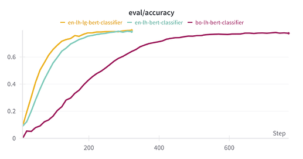
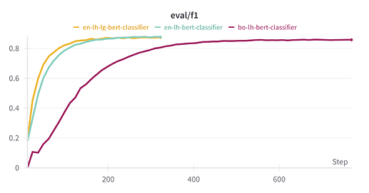
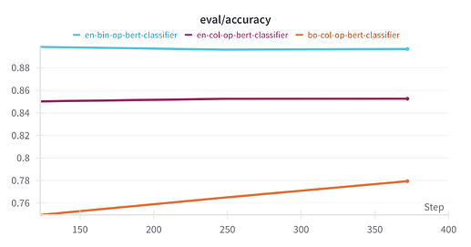
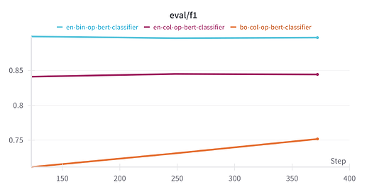

# Domain Tagging With Supervised Clustering for Retrieval Augmented Translation

*Jan 2024*

## Introduction

In a previous post, **[Domain Tagging With Unsupervised Clustering for Retrieval Augmented Translation](https://forum.openpecha.org/t/domain-tagging-with-unsupervised-clustering-for-retrieval-augmented-translation/173)**, I created domain tags for the translation dataset **openpecha/cleaned_MT_v1.0.3**. I used these tags to produce a tagged version of that dataset, **openpecha/tagged_cleaned_MT_v1.0.3**.

However, that approach only provided labels for ~80% of data. To continue improving the tagging of that data, I suggested in that post that one could train supervised models using either a reliably clean human tagged dataset, or simply using the cluster categories that were previously created.

In this post I present and analyze the results of that supervised approach. I begin with a discussion of the use of human labeled data. Then I discuss data that had been previously labeled using unsupervised clustering.

I then present how the models trained with the approaches above were used to create improved tags for the translation dataset **openpecha/tagged_cleaned_MT_v1.0.3**.

Finally, I briefly discuss some general thoughts about sentence-level classification as an approach.

## Data Labeled by Humans

### Dataset

To create a dataset of clean, human tagged data I used sentence pairs from [Lotsawa House](https://www.lotsawahouse.org/) paired with the tags assigned to them by Lotsawa House. This dataset can be seen on Hugging Face at **[billingsmoore/tagged-tibetan-to-english-translation-dataset](https://huggingface.co/datasets/billingsmoore/tagged-tibetan-to-english-translation-dataset)**.

Lotsawa House tags translations based on topic, genre, origin (Indian or Tibetan), and author, though not every translation receives each tag and the number of tags for a translation can vary significantly. For these experiments I used only the first two tags for each translation.

### Classification

#### Methods
Three multi-label BERT classifiers were trained on this data. The first (bo-lh-bert-classifier), a **bert-base** model, used the Tibetan sentences as input . The second (en-lh-bert-classifier), another **bert-base** model, used English sentences as input. The third also used the English sentences but was a larger model, **bert-large** (en-lh-lg-bert-classifier).

For bo-lh-bert-classifier, a custom tokenizer was trained on the Tibetan sentences with a vocabulary size of 30,000 tokens.

#### Results and Discussion

You can see below (Figure 1) that all three models approach an upper bound of accuracy at ~80%. A very similar effect is seen in f1 scores, as well (Figure 2).


*Figure 1*


*Figure 2*

The difference in performance between the Tibetan and English inputs is negligible although the Tibetan model trains more slowly. This is to be expected with a custom tokenizer, however.

Notably, the move to a larger model does not improve performance. This may point to a real upper bound on accuracy. As was seen in the unsupervised approach, it seems that there are sentences that can not on their own be meaningfully categorized. These sentences essentially lack any category information.

## Data Labeled By Unsupervised Clustering 

### Dataset

The dataset used to train a classifier for this portion is the data previously categorized using unsupervised clustering as described in **[Domain Tagging With Unsupervised Clustering for Retrieval Augmented Translation](https://forum.openpecha.org/t/domain-tagging-with-unsupervised-clustering-for-retrieval-augmented-translation/173)**.

To briefly summarize that process, sentences were embedded as vectors using **sentence-transformers/all-MiniLM-L6-v2**. These embeddings were projected into two-dimensions using the **UMAP** algorithm. The two-dimensional data was then clustered using the **HDBSCAN** algorithm.

Once meaningful topics were extracted, cluster categories were visually inspected to remove redundant or overlapping categories. The content of topic clusters was also examined more carefully in order to create informative labels.

### Classification

A series of single label classification models were trained. Each of these models was a **bert-base** model. 

#### All Labels

The first two models trained used all of the 29 labels generated by the unsupervised clustering. The first of these used Tibetan sentences as its inputs, using the tokenizer trained previously for the human labeled data. These models performed better than chance but achieved unacceptably poor accuracy (<60%), with the model trained with English inputs outperforming that trained with Tibetan inputs.

This was found to be a result of the models inability to reliably distinguish between category labels within the set of texts from the Buddhist corpus. The model could however reliably distinguish Buddhist texts from non-Buddhist as well as distinguish scientific texts from fiction, etc.

#### Collapsed and Binary Labels

To address issues in classification using all of the labels, the labels which could be reasonably described as Buddhist, were "collapsed" into a single label, "Buddhist".

Two classifier models were then trained on this data. The first (bo-col-op-bert-classifier), once again, used Tibetan sentences as input. The second (en-col-op-bert-classifier), used English sentences as input.

The labels were then condensed further, with the non-Buddhist labels collapsed to a single label, "Non-Buddhist" to create a *binary* classification task.

One model (en-bin-op-bert-classifier) was trained on this data with English sentences as input.

The results of training these models can be seen in figures 3 and 4.

Both of the "collapsed" label models performed much better than the models trained on the full list of labels. Notably, the English model performed significantly better than the Tibetan. I believe this is the result of the tokenizer, having been trained on the Lotsawa House data, handled non-Buddhist text relatively poorly and that a better tokenizer is necessary for more general usage.

The "binary" model does outperform the "collapsed" model but only by a small amount, and in my opinion the loss in detail in the non-Buddhist labels is not worth the additional accuracy.


*Figure 3*


*Figure 4*

## Tagging Data for Retrieval Augmented Translation

Previously, the results of unsupervised clustering were used to create the dataset **openpecha/tagged_cleaned_MT_v1.0.3**. The results of these experiments have been used to improve the tags on that dataset.

Elements in this data set have the 'Tag' feature which is structured like the example below:

```python
{
  'Buddhist': bool, 
  'LH_labels': list,
  'Topic': str
}

```

For elements which had been previously treated as noise by the clustering model, labels were assigned using the **en-col-bert-classifier** model, which was trained to predict labels based on the previously labeled data. This is the *'Topic'* element of the structure above.

Using those labels (or the labels previously assigned during unsupervised clustering), each element was then classified as either Buddhist or non-Buddhist. This is the *'Buddhist'* element of the structure above.

Elements which were classified as Buddhist were then also supplied with labels predicted by the model **en-lh-bert** which was trained on the human labeled data. This is the *'LH_labels'* element of the structure above.

## General Discussion

I have now written a series of posts analyzing the translation data using unsupervised and supervised approaches. While this work has been fruitful and informative, it has regularly provided what I take to be less-than-ideal results. I believe that much of the trouble is endemic to the attempt to analyze data at the sentence level, and suggest that moving forward classification and clustering instead be aimed at whole documents or, at least, meaningful larger-scale sections of documents.

### Problems In Unsupervised Clustering

Unsupervised approaches yielded a great deal of helpful information about the overall composition of the dataset as a whole. The general mixture of fiction, academic literature, and Buddhist writing was clearly distinguishable and some meaningful subsets of those clusters appeared to be distinguishable.

However, I remain skeptical that this approach produced the most meaningful possible classification. The clusters produced were most informative when the underlying sentences were recognizably from a particular source, but frequently that was not the case, and commonalities that are picked up by clustering algorithms (i.e. the usage of particular words) are not always the most informative with respect to contextual meaning.

### Problems in Supervised Clustering

As can be seen above, classification models do not produce satisfactory accuracy. Even at 85% accuracy, more than 1 in every 10 sentences will be misclassified. This poor accuracy could be initially attributable to failures in the unsupervised approach, but we can see that similar results are seen even on human labeled data. Additionally, the ceiling on performance remains even when a larger model is used, indicating that the problem is not in the model, but rather in the data.

It is simply the case that many sentences fail to be meaningfully classifiable. There are many basic sentence structures and topics that are regularly used across wide swaths of written work that are just not viably classifiable in any reliable fashion.

### Solutions

For standard sentence level translations, I do not think that this is a fatal problem. For the standard user, translation services will likely only be expected to provide passably capable translations of short chunks of text. A user might want to provide directions to a store, or want to translate a comment on social media. In these cases, classification need only provide a general sense of the topic or use-case.

However, for large-scale translations like attempting a translation of a complete book or other lengthy text, this level of inaccuracy is likely not acceptable. 

I have no doubt that there are improvement that could be made in the pipeline that I have developed and used but I am skeptical that those improvements would yield a degree of improvement that would justify the amount of work necessary.

The only reasonable approach, in my view, is to instead approach classification and clustering at much larger scales. The basic components of the data should be whole documents (when short) or sizable excerpts (when source documents are unreasonably large).

This shift in approach will require significant redevelopment of the pipeline that I have thus far prevented in my posts here but I believe that the gains in translation quality will justify that cost.