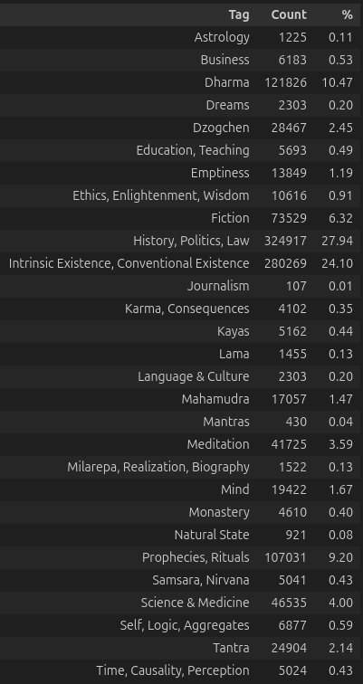

# Domain Tagging With Unsupervised Clustering for Retrieval Augmented Translation

*Dec 2024*

*A previous version of this post mistakenly omitted non-Buddhist material from the analysis. This has now been corrected.*

## Introduction

For retrieval-augmented translation, a database of reference translations can be used to improve the output from the translation model. These translations can be searched prior to generation and appended to the model input appropriately.

To facilitate the search for useful reference translations, the machine translation dataset can be tagged with domain information to convey general topics for which the translations may be useful. 

To this end, the translation dataset (**openpecha/cleaned_MT_v1.0.3**) has been classified into a number of relatively broad domains.

The tagged version of the dataset is privately available on Hugging Face as **openpecha/tagged_cleaned_MT_v1.0.3**

## Methods

To tag the translation data, the dataset was clustered with roughly the same process that I have used in my previous posts on topic modeling the translation dataset. (i.e. [**Topic Modeling Buddhist Material in the Translation Dataset**](https://forum.openpecha.org/t/topic-modeling-buddhist-material-in-the-translation-dataset/91))

### Clustering
Sentences were embedded as vectors using **sentence-transformers/all-MiniLM-L6-v2**

These embeddings were projected into two-dimensions using the **UMAP** algorithm.

The two-dimensional data was then clustered using the **HDBSCAN** algorithm.

A random set of 10 samples from each cluster were then fed to **mistralai/Mixtral-8x7B-Instruct-v0.1** for summarization using the following prompt: “Use three words total (comma separated)to describe general topics in above texts. Under no circumstances use enumeration. Example format: Tree, Cat, Fireman”

These cluster labels were then edited manually to be more reliably descriptive.

### Extracting Meaningful Domain Topics

Once clusters had been established they were further summarized into a relatively small number of broad but meaningful domain categories. The indexes of elements in the dataset which belonged to those categories were stored in a dictionary for reference.

This process was repeated numerous times to ensure a maximum number of elements were able to be categorized.

### Categorizing Texts

Once meaningful topics were extracted, cluster categories were visually inspected to remove redundant or overlapping categories. The content of topic clusters was also examined more carefully in order to create informative labels.

## Results

Ultimately,  meaningful tags were possible for approximately 81.4% of the dataset using this method. The remainder of the data was classified as noise by the clustering pipeline. By repeating this process with a larger acceptable number of clusters, or with more granular topics, this number could be significantly increased.

There are 29 tags created with this process and their counts and proportions of the dataset at large can be seen in the table below.

## Discussion
These categories are intended to be sufficiently broad as to capture a significant portion of the data, yet specific enough to be meaningful. The extent to which this is achieved is perhaps subjective, but this presents, at least, a useful starting point.

Each of these categories can easily be split into multiple categories or into sub-categories as may be appropriate by repeating the methods described above.

### Limitations

Because the dataset consists of sentence pairs, all clustering and categorizations occurred at the sentence level. As a result, tags must often refer to what the sentence is about, not necessarily what context the sentence might occur in. An effort was made to investigate possible sources and the impact of this investigation can be seen in the tags 'Fiction', 'Journalism', etc. However, the size of the dataset made the close examination of each tag impractical.

For example, a sentence about meditation methods may occur in a Dzogchen or Mahamudra context with very different intended interpretations, but at the level of the individual sentence there may be no way to distinguish which context is correct.

### Suggestion for Further Work

The simplest way forward would to simply be to repeat this process to increase the number of topic labels with increasing granularity. However, it seems valuable to validate that this approach improves translation quality before moving forward.

One way to side-step the issue of sentence-level topic ambiguity is to train a classifier on a previously well-tagged document-level dataset. 

For example, Lotsawa House provides a reliable tagging schema on each of their translations, i.e. the sadhana text  'A Brief Amitabha Sleeping Practice', is tagged with 'Amitabha', 'Sleep and Dream', 'Tibetan Masters', and 'Jamyang Khyentse Chokyi Lodro' (the author). 

Sentences from the documents could be extracted (with their tags preserved) and used for classifier training. This classifier could then be used to predict tags for reference translations.

Additionally, it is worth verifying that these sorts of tags are significantly more efficient, or produce a significantly better result than other approaches. For example, one could simply implement a similarity search across an entire database of reference translations. Intuitively, it seems clear that domain tagging is preferable, but it is worthwhile to validate this.