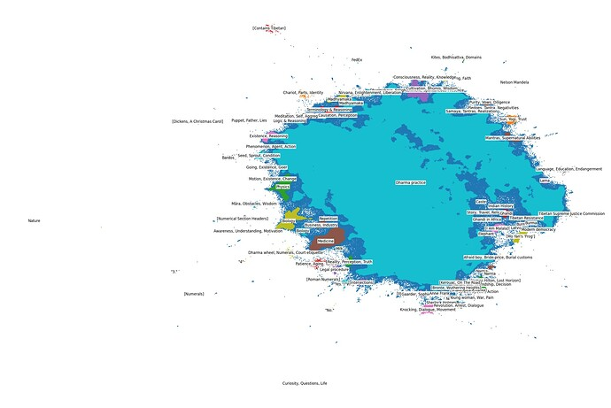

# Modeling the Full Translation Dataset

*Nov 2024*

## Summary

Following results from [' A First Look at Topic Modeling for the Translation Dataset'](https://forum.openpecha.org/t/a-first-look-at-topic-modeling-for-the-translation-dataset/70), topic modeling was conducted the full translation dataset **openpecha/cleaned_MT_v1.0.2**. The results of this can be seen below.

### Explanation of Cluster Labels
Most clusters are label according to a brief list of topics that are contained in the cluster.

Clusters whose labels are of the form "label" are clusters composed predominantly of texts which are just the the text in the label. For example, the cluster "3." contains almost exclusively elements of the dataset where the entirety of the target sentence is "3."

Clusters whose labels are of the form [label] contain texts that are described by the label but are not necessarily *about* the label. For example [Numerical Section Headers] contains texts which are themselves numerical section headers (i.e. '2.3.2.2.3').

Elements of the dataset whose source text was readily identifiable are given as [Author, Title]. For example, [Dickens, A Christmas Carol] contains sentences from 'A Christmas Carol' by Charles Dickens.

### Brief Analysis

We can see that the overwhelming majority of texts are Buddhist in nature. These are not well differentiated here in part because of the presence of extreme outliers in the dataset.

#### Junk Data
These outliers are partially junk data that can and should be removed from the dataset. For example, [Roman Numerals] contains texts whose entire target sentence consists exclusively of Roman numerals. These and other clusters (i.e. "3.", "4") may also indicate problems in the machine alignment more generally, as they are likely the result of programmatically splitting source texts at punctuation, which may not accurately reflect the Tibetan input sentence.

Other problematic clusters include [Contains Tibetan] which consists of elements whose target sentence in English contains Tibetan. These are primarily from language learning texts. As well as "Yes" and "No." which contain primarily target sentences that consist only of the word "yes" or "no" respectively.

#### Fiction

In addition to [Dickens, A Christmas Carol], the dataset features (visible on the bottom right of the visualization above) a number of pieces of literary fiction, including stories from Harry Potter and Sherlock Holmes. 

These texts are unlikely to be tremendously helpful in producing high quality translation of religious texts, but are probably valuable context for translating more contemporary, or less formal, works.

#### Contemporary Non-Fiction

Adjacent to fiction in the visualization are a set of contemporary non-fiction texts. These include works on history, politics, and the autobiographies of Mahatma Ghandi and Malala Yousafzai. 

On the left edge of the main mass in the visualization are clusters of more academic non-fiction. These include academic publications on biology, physics, medicine, and finance.

As with the fiction, these texts are likely to be valuable in translation of contemporary works, but their domain-specific jargon is most likely unhelpful for translating older texts.

#### Dharma Texts

The majority of the dataset is religious or philosophical in nature. Although certain key topics pop out here (Madhyamaka, Tantra, Existence, Awareness) it is likely not helpful to take this to be too helpful in understanding the details of the dataset.

The presence of the dramatically distinct material leads to much of the Buddhist material being either lumped together without much meaningful connection, or being treated as noise in the data.

## Methods

This analysis uses similar methods to **A First Look at Topic Modeling for the Translation Dataset**. With the exception of fitting of the projection algorithm, choice of clustering algorithm, and manual cleaning of cluster labels.

The Python library used to execute this pipeline is **easy_text_clustering**

Sentences were embedded as vectors using **sentence-transformers/all-MiniLM-L6-v2**

These embeddings were projected into two-dimensions using the **UMAP** algorithm.

The two-dimensional data was then clustered using the **HDBSCAN** algorithm.

A random set of 10 samples from each cluster were then fed to **mistralai/Mixtral-8x7B-Instruct-v0.1** for summarization using the following prompt: “Use three words total (comma separated)to describe general topics in above texts. Under no circumstances use enumeration. Example format: Tree, Cat, Fireman”

These cluster labels were then edited manually to be more reliably descriptive, though some labels remain less than meaningful, reflecting the lack of cohesive theme in the texts in the cluster.

The clusters and the summary labels were then plotted using **Plotly**.

## Next Steps

From here, the next step should be to curate a subset of this data which excludes the less relevant data mentioned above. From there, this pipeline can be re-executed in order to get a better view of the composition of the Buddhist materials.