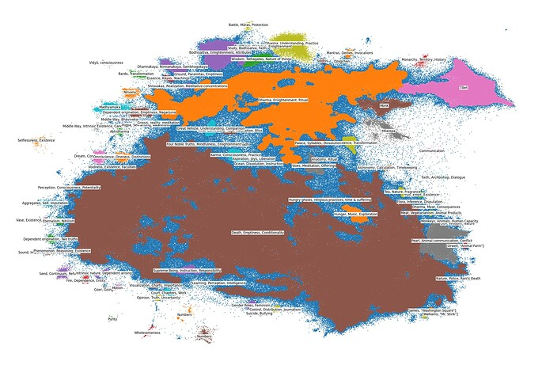

# Topic Modeling Buddhist Material in the Translation Dataset

*Nov 2024*

Following results from **[Modeling the Full Translation Dataset](https://forum.openpecha.org/t/modeling-the-full-translation-dataset/85)**, obviously non-Buddhist materials were excluded from the dataset and topic modeling was conducted on the remaining texts. The results can be seen below.

## Brief Analysis

Typical topics and themes from the Buddhist literature are visibly present in the data. The relative ease of finding these topics bodes well for the possibility of training classifiers and/or tagging data for retrieval augmented generation.

The presence of relatively large clusters suggests the possibility of continuing to drill down to smaller datasets. However, I believe it is worthwhile to first, complete a more thorough cleaning of the dataset, and second, determine (if only at a reasonably high level) the objectives of more specific topic modeling whether to create an ontology for the data, attempt to determine specific source texts, etc.

### Problem Data

#### Junk Data

Some elements of the Buddhist material continue to be plagued by numbers or roman numerals which lead to undesirably noisy results. Examples of this include the 'Numbers' clusters that are dangling from the bottom of the main mass in the visualization.

#### Fiction
Despite the attempt to exclude irrelevant materials, the dataset still contained some texts from identifiable pieces of reasonably contemporary fiction.

Elements of the dataset whose source text was readily identifiable are given as [Author, Title]. For example, [Dickens, A Christmas Carol] contains sentences from ‘A Christmas Carol’ by Charles Dickens. 

Examples in the dataset can be seen in the bottom right side of the main mass in the visualization above.

## Methods

As in previous posts on topic modeling, the Python library used to execute this pipeline is **easy_text_clustering**

Sentences were embedded as vectors using **sentence-transformers/all-MiniLM-L6-v2**

These embeddings were projected into two-dimensions using the **UMAP** algorithm.

The two-dimensional data was then clustered using the **HDBSCAN** algorithm.

A random set of 10 samples from each cluster were then fed to **mistralai/Mixtral-8x7B-Instruct-v0.1** for summarization using the following prompt: “Use three words total (comma separated)to describe general topics in above texts. Under no circumstances use enumeration. Example format: Tree, Cat, Fireman”

These cluster labels were then edited manually to be more reliably descriptive, though some labels remain less than meaningful, reflecting the lack of cohesive theme in the texts in the cluster.

The clusters and the summary labels were then plotted using **Plotly**.